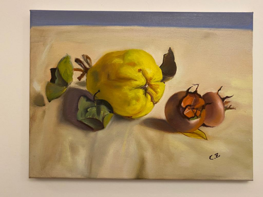

<!-- README.md is generated from README.Rmd. Please edit that file -->

# Chen’s Gallery

<!-- badges: start -->

<!-- badges: end -->

The goal of Chen’s Gallery is to showcase all art pieces on a single
website.

## Website

[Tian Tian’s Gallery](https://tiantiandegallery.netlify.app/)

## Github

[Github Repro](https://github.com/deadhand777/chensgallery)

## Docker

[Docker](https://www.docker.com/)

## Netlify

[Netlify](https://app.netlify.com/teams/chris-schulz13/overview)
